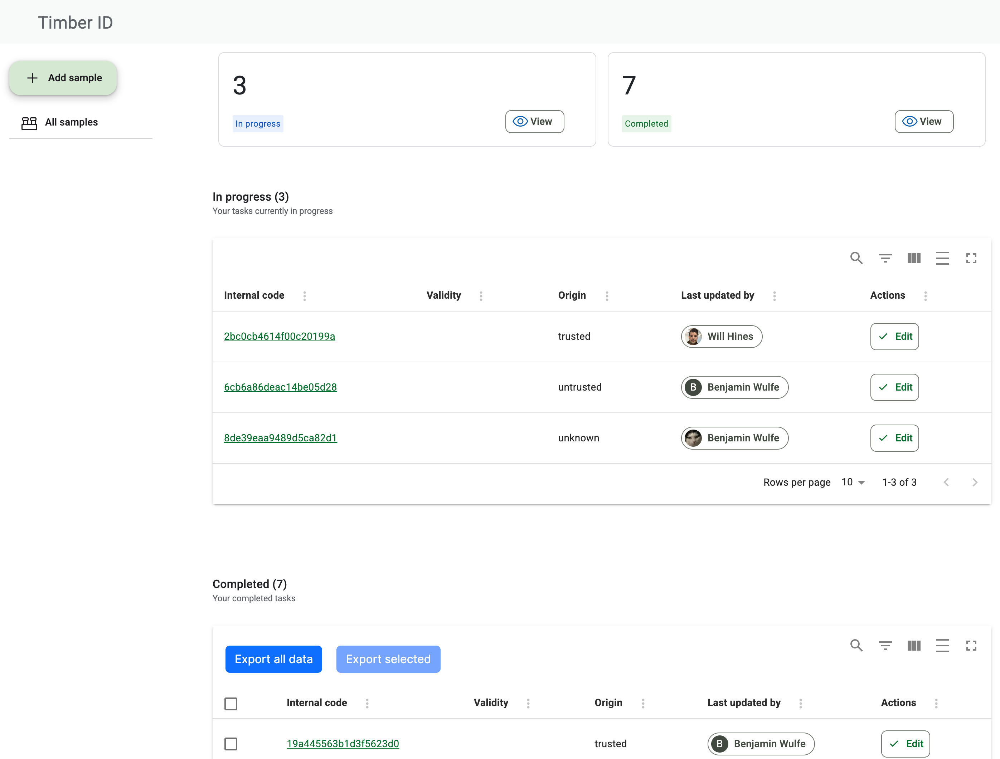

# 🌳 Welcome to TimberID

<figure><figcaption></figcaption></figure>

[**TimberID**](https://timberid.org) is a web application and API created for researchers, auditors and enforcement professionals to manage, analyze and share information on timber samples collected from the Brazilian rainforest.

TimberID analysis helps understand the actual location a seized timber was harvested. This information is crucial to preventing deforestation and degradation of protected areas of the Amazon. This protects a vital resource for Brazil and helps safeguard the environment.

The API allows researchers to easily access reference information and analysis through Earth Engine. TimberID uses its own API to obtains inputs for machine learning that build timber based [isoscapes](overview/background.md) (isotopic maps) of the Brazilian rain-forest.

Finally, TimberID introduces an innovative approach to building isoscapes (isotopic maps) of the amazon using a [machine learning variational model](architecture-of-timberid/detailed-design/research-colabs/isoscape-generation.md).

### Who can use TimberID?

TimberID is _currently_ optimized for researchers, auditors and enforcement professionals. Users register in TimberID to be part of a new or existing _organization_. All inputted sample data is private within an organization, and is not visible to other organizations.&#x20;

Researchers can use the Web UI to input and manage their timber samples. They record aspects about each of their reference samples, such as isotopic measurements or species. After entering reference sample data, they may use the provided Earth Engine API to access this data to perform additional geospatial research.

Auditors and enforcement can use TimberID to perform an analysis on seized timber. When users enter data on seized timber, analysis such as an isotopic t test is performed. This test gives a statistical probability that the given timber sample actually came from the location it's owner claimed.  This analysis also includes nearby MapBiomas Alerta deforestation alerts, vegetation and water cover maps. The goal is for TimberID to centralize the numerous signals that may be relevant to a piece of seized timber.

TimberID is open source and easy to extend. We invite researchers to add further analysis both on the timber sample and the claimed or actual locations the tree was obtained.

