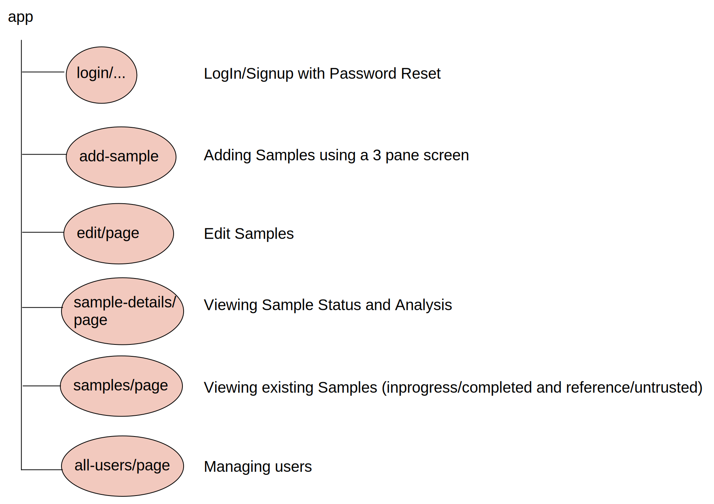

# 🌐 Client

## FrontEnd Detail Design

The Client consists of the Front End, which is written in Typescript and hosted using [Firebase Hosting](https://firebase.google.com/docs/hosting). This is a Firebase web application and directly reads and writes to the underlying backend [Firestore](https://firebase.google.com/docs/firestore).


The Front End is open sourced at [the tnc-br github organization](https://github.com/tnc-br/ddf-sample-tracking/tree/main).


The client contains the following functionality



### Login, Signup and Password Reset

TimberID uses built in Firebase functionality to sign up with Google or email/password.

[login.tsx](https://github.com/tnc-br/ddf-sample-tracking/blob/main/sample\_tracking/app/login/login.tsx#L30C1-L42C15)

```typescript
    function attemptSignIn() {
        setErrorText({email: '', password: ''})
        setSubmitIsLoading(true);
        const email = (document.getElementById('email') as HTMLInputElement).value;
        const password = (document.getElementById('password') as HTMLInputElement).value;
        console.log('username: ' + email + ' password: ' + password);
        signInWithEmailAndPassword(auth, email, password)
            .then((userCredential) => {
                // Signed in 
                const user = userCredential.user;
                console.log('signed in');
                router.push('/samples');
            })
```

signInWithEmailAndPassword is built into Firebase as are GoogleAuthProvider.

Users must choose an Organization when they sign in, which determines what data they see.

Security Rules are described in depth in the [Server](server.md) section.


### Confirming User Permissions&#x20;

User data and permissions are stored in the "users" collection in Firestore. Each user has their own document where the document ID is the user's Firebase auth user ID making it easy to know which document to fetch when checking which permissions a user has. The following data is stored for each user:&#x20;

```json
{
 date_added: string
 email: string
 name: string // First and last name 
 org: string // The org ID number 
 org_name: string // The org name
 role: string // Can only be either "member", "admin" or "site_admin"
}
```

We know what a user's permissions are based on the role they have. A member can only create/view/edite samples in their organization. An admin is an org admin and has full control of all aspects of their organization including approving new members, promoting other members to admin status, and removing members from their organization. A site\_admin has full control of all aspects of the site including approving any member request, removing any member from any org, viewing any sample created on the application, and promoting members or admins to site\_admin status.&#x20;

These roles must be checked when a user attempts to access a page that is meant only for specific user roles. For example the following snippet shows how to check if a user is an admin or site\_admin and forwards them away from the page if they aren't.&#x20;

```typescript
onAuthStateChanged(auth, (user) => {
    if (!user) {
        router.push('/login');
    } else {
        const userDocRef = doc(db, "users", user.uid);
        getDoc(userDocRef).then((docRef) => {
            if (docRef.exists()) {
                const docData = docRef.data();
                    if (docData.role !== 'admin' && docData.role !== 'site_admin') {
                        router.push('/samples');
                    }
                    setUserData(docRef.data() as UserData);
                }
            }).catch((error) => {
                console.log(error)
            });
        }
    });
```

Even if a user falls through this test without the correct role, the Firestore security rules will make sure they don't see any privileged information however it is best if they don't have access to the pages in the first place. Only an admin has permissions to update the data in a user's user document.&#x20;

### New user flow

When a new user attempts to join the application their data is added as a new document to the "new\_users" collection with the new users firebase auth user ID as the document ID.&#x20;

When an org admin goes to the "Sign up requests" page, the "new\_users" collection is searched for users attempting to join the same organization as the admin and are shown to the admin to be approved/rejected. If a user is approved, a new entry is made for them in the "users" collection with the data shown above.&#x20;

If a new user attempts to create a new organization when they sign up, their data is added to the "new\_orgs" document in the "new\_users" collection. These requests are only shown to the site\_admin to be approved/rejected.&#x20;

### Lists (Species, Municipalities)

It's very likely that the list for Species or Municipalities will need to be updated in the future.  These can be found below.

| Data Source    | Location                                                                                                                          | Original Source                                                                                                                                      |
| -------------- | --------------------------------------------------------------------------------------------------------------------------------- | ---------------------------------------------------------------------------------------------------------------------------------------------------- |
| Species        | [species\_list.tsx](https://github.com/tnc-br/ddf-sample-tracking/blob/main/sample\_tracking/app/species\_list.tsx)               | Originally obtained from imaflora. An outstanding item is to query this data dynamically from [Brazilian Flora](https://servicos.jbrj.gov.br/flora/) |
| State List     | [states\_list.tsx](https://github.com/tnc-br/ddf-sample-tracking/blob/main/sample\_tracking/app/states\_list.tsx)                 | List of states in Brazil                                                                                                                             |
| Municipalities | [municipalities\_list.tsx](https://github.com/tnc-br/ddf-sample-tracking/blob/main/sample\_tracking/app/municipalities\_list.tsx) | List of valid municipalities in Brazil                                                                                                               |

### Localization

Translation to Portuguese may be incorrect as the original source of TimberID is english. You can find all translated snippets [here](https://github.com/tnc-br/ddf-sample-tracking/blob/main/sample\_tracking/app/i18n/locales/pt/translations.json).

There also may be cases where the text had never been translated at all. If that happens, you can follow the pattern of another localized snippet and reference translations.json.

For example, meanAnnualPrecipitation is localized in [sample\_data\_input](https://github.com/tnc-br/ddf-sample-tracking/blob/main/sample\_tracking/app/sample\_data\_input.tsx#L655) via t('meanAnnualPrecipitation'):

```html
    <div className='input-text-field-wrapper half-width'>
        <TextField
            size='small'
            fullWidth
            id="mean_annual_precipitation"
            name="mean_annual_precipitation"
            label={t('meanAnnualPrecipitation')}
            sx={style}
            onChange={handleChange}
            value={formData.mean_annual_precipitation}
        />
    </div>
```

Add your string to [translations.json](https://github.com/tnc-br/ddf-sample-tracking/blob/main/sample\_tracking/app/i18n/locales/pt/translations.json) for every language and then use the style above to pull it from the localization table.

### Deploying Front End for Testing and Production

You should first install the [firebase CLI](https://firebase.google.com/docs/hosting#implementation\_path) to manage deployments.  This tool allows you to [view and test your changes before going live](https://firebase.google.com/docs/hosting/test-preview-deploy).

The github repository has github actions already configured to generate live previews URLS for all PRs.  You can find out more about how these actions were configured [here](https://firebase.google.com/docs/hosting/github-integration#set-up).

* Merging code into the Main branch will automatically update the development environment: [test.timberid.org](https://test.timberid.org).


Before merging a PR to Main, you should have unit tests and manually test with the generated hosted url github actions created for you.


* Merging code into the PRD branch will automatically update the production environment.&#x20;


Before merging code from Main into the PRD branch, you should run through the [manual test procedures](../test-procedure-for-production-release.md) on test.timberid.org, which should have latest source from the Main branch.


#### Domain Name Management and Custom Domain Names

Currently, TimberID.org has two domains

| Domain Name       | Management Url                                                                                                                                           | Description                                                                               |
| ----------------- | -------------------------------------------------------------------------------------------------------------------------------------------------------- | ----------------------------------------------------------------------------------------- |
| TimerID.org       | [https://domains.google.com/registrar/timberid.org/dns?authuser=0\&hl=en-US](https://domains.google.com/registrar/timberid.org/dns?authuser=0\&hl=en-US) | Production website automatically sync'd to the PRD branch                                 |
| Test.TimberID.org | [https://domains.google.com/registrar/timberid.org/dns?authuser=0\&hl=en-US](https://domains.google.com/registrar/timberid.org/dns?authuser=0\&hl=en-US) | Test branch with separate database and functions, automatically sync'd to the main branch |
|                   |                                                                                                                                                          |                                                                                           |

