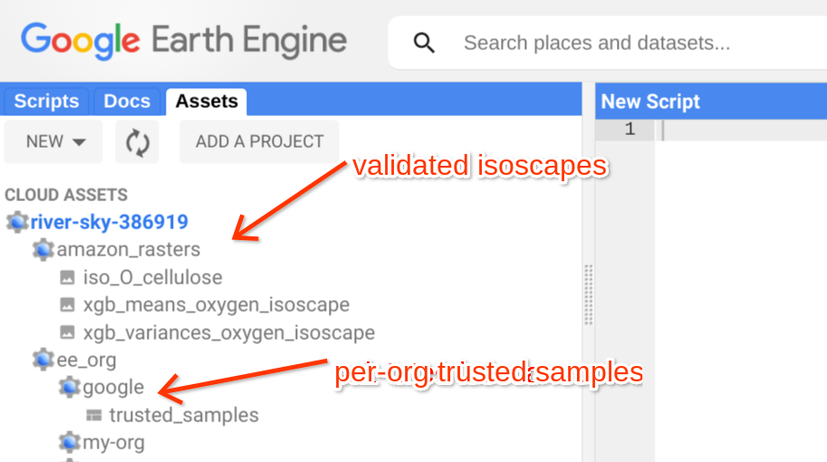

# 🌎 Earth Engine

## Source Location

The Earth Engine Ddf API is built in the [ddf\_common github repository](https://github.com/tnc-br/ddf\_common).  As described in the Earth Engine API userguide, the Ddf EE API is mostly a wrapper around the existing Earth Engine API.

However it is more turnkey due to automatic management of Earth Engine assets and authorization from TimberId.

### How it works

Two earth engine based cloud functions export the reference sample data in a per-organization layout and the user information that automatically grants access either directly in the earth engine code editor or through the Ddf EE API.

#### The Earth Engine Code Editor

These assets can be seen by directly loading the [Earth Engine Code editor](https://code.earthengine.google.com/). Note that you must have developer admin permissions (see the [Admin page](../../internal/internal-information.md) for details) to see the Assets in the asset collection. Without this permission, you can still write script applications and read assets, but not list them.

<figure><figcaption></figcaption></figure>

#### Updating Isoscapes

You must upload a stamped isoscape using the EE API upload script (see the [codelab](https://colab.sandbox.google.com/github/tnc-br/ddf\_common/blob/ddf\_ee\_api/ddf\_ee\_api.ipynb) for an example). This preserves important medata on the isoscape used during analysis.

#### Functions that use Earth Engine

Many cloud functions that analyze timber use data from Earth Engine (whether its one of our generated isoscapes or data from 3rd parties like mapbiomas). These functions use the normal EE API when necessary. We have not yet packaged the Ddf EE API in a standalone pip installable package.

