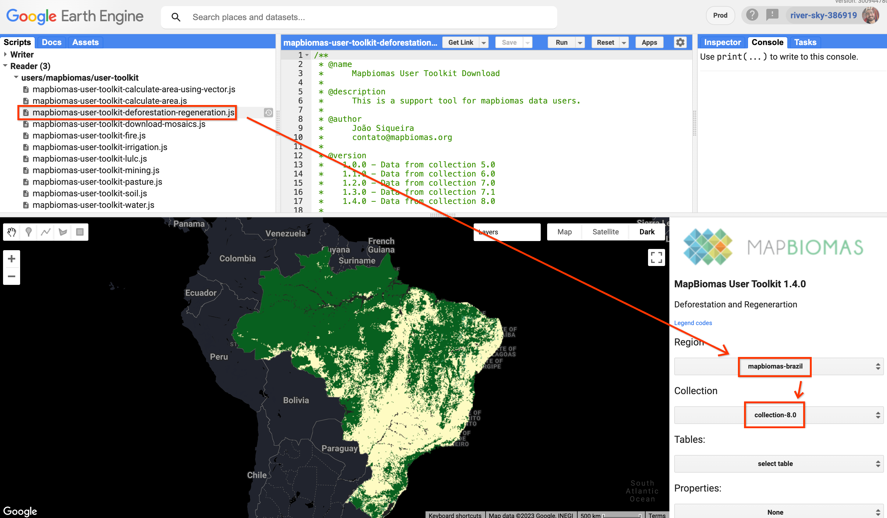
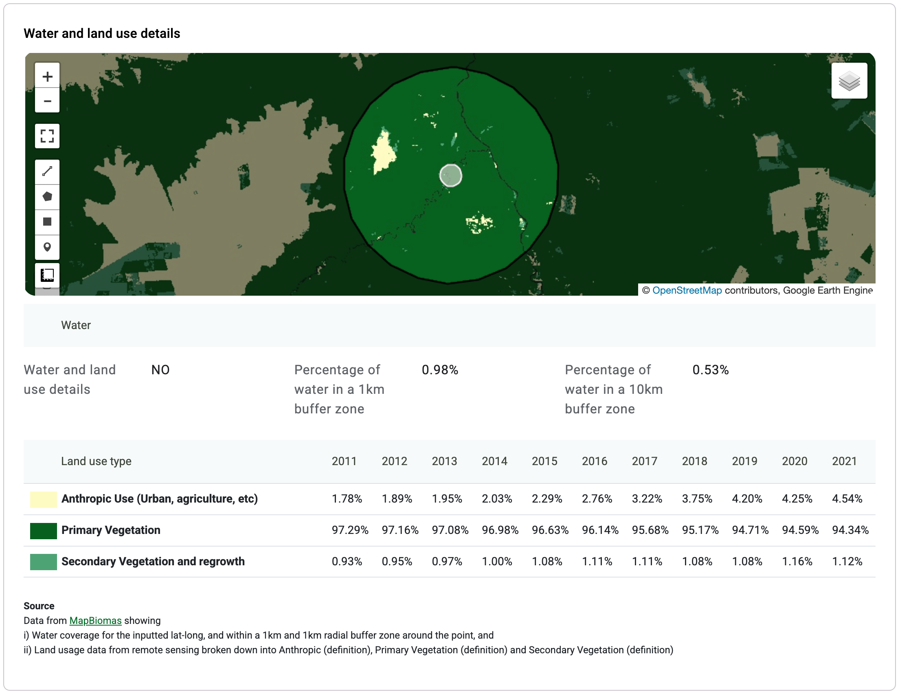

# 🗺 External integrations and maps

TimberID pulls data from external data sources to enhance the sample report for uncertain/untrusted samples. These are:

* **MapBiomas** ([https://plataforma.brasil.mapbiomas.org/](https://plataforma.brasil.mapbiomas.org/))
  * Land use map&#x20;
  * Land use statistics
    * Water (rivers, lakes, etc)
    * Primary vegetation (Forest)
    * Secondary vegetation and regrowth (e.g. pastures)
    * Anthropic use (e.g. agriculture, urban areas)
* **MapBiomas Alerta** ([https://plataforma.alerta.mapbiomas.org/](https://plataforma.alerta.mapbiomas.org/))
  * Deforestation alerts

## MapBiomas (Land Use Data and Map)

The [MapBiomas project](../../user-guide/registering.md) provides Google Earth Engine (GEE) images of land use data in Brazil.&#x20;

To access this data from the Earth Engine code editor ([https://code.earthengine.google.com](https://code.earthengine.google.com)) you can [**use this link to add the MapBiomas user toolkit**](https://code.earthengine.google.com/?accept\_repo=users/mapbiomas/user-toolkit) to your scripts folder. You can also find the [MapBiomas user toolkit on Github](https://github.com/mapbiomas-brazil/user-toolkit). You can also find the [MapBiomas entry in the GEE Community Catalog](https://gee-community-catalog.org/projects/mapbiomas/) for more info.

Once you add the user toolkit, you can access the deforestation images like so:

<figure><figcaption>
Screenshot from the MapBiomas user toolkit on <a href="https://code.earthengine.google.com/">code.earthengine.google.com</a>
</figcaption></figure>

MapBiomas releases their updated data in regular "collections". You can find the [GEE Image url to the images in the source code](https://github.com/mapbiomas-brazil/user-toolkit/blob/ca96b660ea8b21df54629463d794c216e11c309c/mapbiomas-user-toolkit-deforestation-regenerartion.js#L458).

***

This is an example of how this image is displayed in TimberID, in the sample details page.This is only displayed for uncertain/untrusted samples, not for reference/trusted samples.

<figure><figcaption>
Screenshot of the sample details page of an untrusted sample
</figcaption></figure>

The MapBiomas map is centered on the `[latitude, longitude]` of the sample, showing a 1 km buffer zone (in white) and a 10km buffer zone (in black). Below the map, the UI displays what current percentage of land is water in both 1km and 10km radii, and below the map are details of each land use category for the last 10 years of MapBiomas data (2011 - 2021).

### Embedded Map

The map is created using the Earth Engine Python API, using the [`geemap` module](https://geemap.org/).

[**Geemap**](https://geemap.org/) allows students and researchers to use the Python ecosystem of diverse libraries and tools to explore Google Earth Engine. In particular, it's designed for existing GEE users who would like to transition from the GEE JavaScript API to Python API, so the library will be familiar for uses of the former.

The creation of map is mediated by **Cloud Functions,** specifically the [fraud-detection-generate-maps](https://github.com/tnc-br/ddf-insights-analytics/tree/main/fraud-detection-generate-maps) function (see [more details on Cloud Functions here](server.md#cloud-functions)). You can see a diagram of how that works below:

<figure><figcaption>
Architecture diagram of land use maps in TimberID (<a href="https://excalidraw.com/#json=h5dyaDj9H6ebJhmK2FkON,1ph4a7bTCjgBR8BpxhrN0g">Excalidraw</a>). 
</figcaption></figure>

The <mark style="color:blue;">**blue flow**</mark> happens once a day at 9am, the <mark style="color:orange;">**orange flow**</mark> is triggered every time a sample is created or modified.


Maps for every sample are regenerated every day by the flow <mark style="color:blue;">**displayed in blue**</mark>. This is because the `geemap` assets in the generated HTML expire after 48 hours.&#x20;


You can find links each of the components below:

* **Cloud Scheduler:**
  * Dev: [fraud-detection-generate-maps-daily](https://console.cloud.google.com/cloudscheduler/jobs/edit/southamerica-east1/fraud-detection-generate-maps-daily?project=river-sky-386919) - Prod: [fraud-detection-generate-maps-daily](https://console.cloud.google.com/cloudscheduler/jobs/edit/southamerica-east1/fraud-detection-generate-maps-daily?project=timberid-prd)
* **Pub / Sub:**
  * Dev: [fraud-detection-generate-maps-daily](https://console.cloud.google.com/cloudpubsub/topic/detail/fraud-detection-generate-maps-daily?project=river-sky-386919) - Prod: [fraud-detection-generate-maps-daily](https://console.cloud.google.com/cloudpubsub/topic/detail/fraud-detection-generate-maps-daily?project=timberid-prd)
* **Cloud Functions:**
  * [fraud-detection-generate-maps](https://github.com/tnc-br/ddf-insights-analytics/tree/main/fraud-detection-generate-maps)
  * [fraud-detection-update-sample](https://github.com/tnc-br/ddf-insights-analytics/tree/main/fraud-detection-update-sample)
* **Cloud Storage Bucket:**
  * Dev: [timberid-public-to-internet](https://console.cloud.google.com/storage/browser/timberid-public-to-internet;tab=objects?forceOnBucketsSortingFiltering=true\&project=river-sky-386919\&prefix=\&forceOnObjectsSortingFiltering=false) - Prod: [timberid-public-to-internet](https://console.cloud.google.com/storage/browser/timberid-public-to-internet;tab=objects?forceOnBucketsSortingFiltering=true\&project=timberid-prd\&prefix=\&forceOnObjectsSortingFiltering=false)
* **Component containing map's iframe on frontend:**
  * [LandUseDetailsSection.tsx](https://github.com/tnc-br/ddf-sample-tracking/blob/dd913f983a96dc21b9db8cef24c46f1896194b58/sample\_tracking/app/sample-details/components/LandUseDetailsSection.tsx)

### Land Use Data

Land Use Data is calculated in the [fraud-detection-update-sample](https://github.com/tnc-br/ddf-insights-analytics/tree/main/fraud-detection-update-sample) function, specifically in the section [fraud\_detection\_fetch\_land\_use\_data.py](https://github.com/tnc-br/ddf-insights-analytics/blob/cfe2f79715eff8224559e7ac6580e47af611c81e/fraud-detection-update-sample/fraud\_detection\_fetch\_land\_use\_data.py). This uses the Earth Engine Python API.

## MapBiomas Alerta (deforestation alerts)

This is an example of how deforestation alerts data is displayed in TimberID, in the sample details page. This is only displayed for uncertain/untrusted samples, not for reference/trusted samples.

<figure><figcaption>
Screenshot of the sample details page of an untrusted sample
</figcaption></figure>

The corresponding page to each alert is linked on the details column under "More info". You can see an [example alert here](https://plataforma.alerta.mapbiomas.org/laudo/7227).

This data comes from MapBiomas Alerta's GraphQL API. Deforestation alerts data is fetched and stored in the [fraud-detection-update-sample](https://github.com/tnc-br/ddf-insights-analytics/tree/main/fraud-detection-update-sample) function, specifically in the section [fraud\_detection\_fetch\_mapbiomas\_alerts.py](https://github.com/tnc-br/ddf-insights-analytics/blob/cfe2f79715eff8224559e7ac6580e47af611c81e/fraud-detection-update-sample/fraud\_detection\_fetch\_mapbiomas\_alerts.py).&#x20;

This API is generally available and doesn't require authentication. You can find more details about the API in this link: [https://plataforma.alerta.mapbiomas.org/api](https://plataforma.alerta.mapbiomas.org/api) (viewing this page requires login, create a new account to access the content). This link also includes a Sandbox to test this GraphQL api, too.
