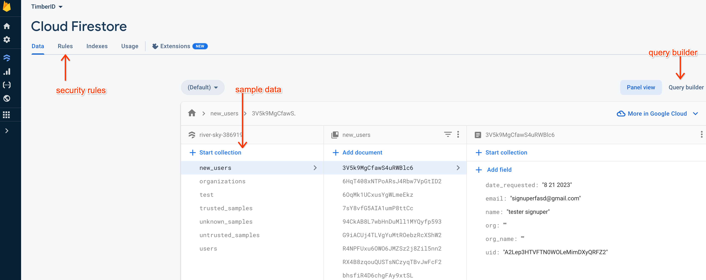
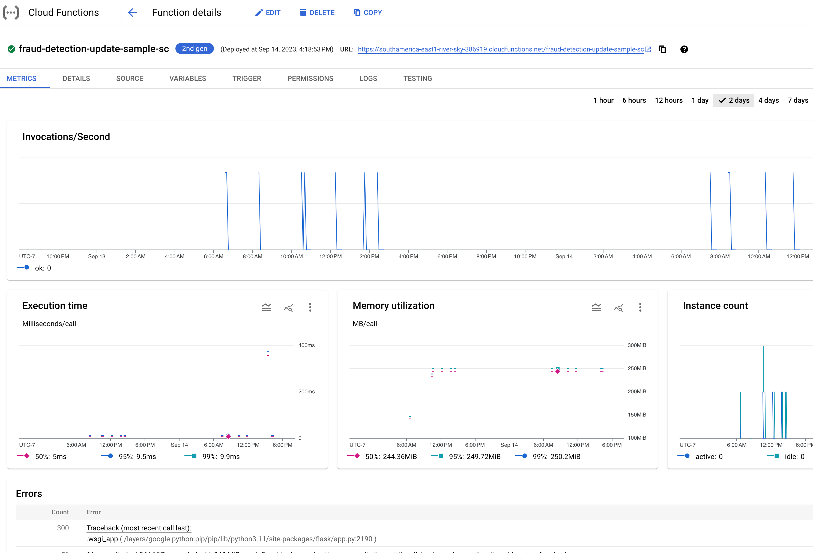

# 🖥 Server

### Database design&#x20;

The database is a [Cloud Firestore](https://firebase.google.com/docs/firestore) Database. Cloud Firestore is a flexible, scalable NoSQL cloud database. It leverages Firebase Authentication to eliminate a middle tier and allow secure direct read/writes from the front end.


The <mark style="color:green;">**development**</mark> database can be found [here](https://console.cloud.google.com/firestore/databases/-default-/data/query;collection=%2Fnew\_users?authuser=0\&project=river-sky-386919). \
The <mark style="color:red;">**production**</mark> database can be found [here](https://console.cloud.google.com/firestore/databases/-default-/data/query;collection=%2Fnew\_users?authuser=0\&project=timberid-prd).


The schema of the database is below.

<table><thead><tr><th width="188">Document </th><th width="181">Field</th><th>Data</th></tr></thead><tbody><tr><td>trusted_samples</td><td></td><td>All data for a particular trusted sample including metadata like site of collection, and user who entered the sample, as well as the results.<br>Each document is a single sample that may contain multiple measurements.</td></tr><tr><td></td><td>code: Str</td><td>The unique id associated with the sample</td></tr><tr><td></td><td>created_by: Str</td><td>The id of the user who created the entry</td></tr><tr><td></td><td>created_by_name: Str</td><td>The user name of the creator</td></tr><tr><td></td><td>create_on: Str</td><td>The date which this sample was entered into the database</td></tr><tr><td></td><td>n_wood:[float]</td><td>Percentage of nitrogen<br>Valid Range: 0%..1%</td></tr><tr><td></td><td>c_wood:[float]</td><td>Percentage of Carbon in Wood<br>Valid Range: 40%...60%</td></tr><tr><td></td><td>c_cel:[float]</td><td>Percentage of Carbon in Cellulose<br>Valid Range: 40%...60%</td></tr><tr><td></td><td>d13C_cel:[float]</td><td>The delta C-13 isotope ratio as measured on cellulose by a mass spectrometer.<br>Valid Range: -35..-20</td></tr><tr><td></td><td>d13C_wood:[float]</td><td><p>The delta C-13 isotope ratio as measured on wood by a mass spectrometer.</p><p>Valid Range: -38...20</p></td></tr><tr><td></td><td>d15N_wood:[float]</td><td>The delta N-15 isotope ratio as measured on wood by a mass spectrometer.<br>Valid Range: -5...15</td></tr><tr><td></td><td>d18O_wood: [float]</td><td>The delta O-18 isotope ratio as measured on wood by a mass spectrometer.<br>Valid Range: 20...32</td></tr><tr><td></td><td>d18O_cel:[float]</td><td>The delta O-18 isotope ratio as measured on cellulose by a mass spectrometer.<br>Valid Range: 20...32</td></tr><tr><td></td><td>last_updated: str</td><td>The datetime when this sample entry was last updated</td></tr><tr><td></td><td>lat: Float</td><td>For trusted samples, it is the known latitude where the original tree had been felled for collection.</td></tr><tr><td></td><td>lon: Float</td><td>For trusted samples, it is the known longitude where the original tree had been felled for collection.</td></tr><tr><td></td><td>municipality: Str</td><td>The Brazilian municipality closest to the lat/lon given</td></tr><tr><td></td><td>org: Str</td><td>The organization id that owns this data</td></tr><tr><td></td><td>org_name: Str</td><td>The organization name</td></tr><tr><td></td><td>points: [Struct]</td><td>Points is a collection of arbitrary fields as seen by an import. Every column during an import is loaded into the database into this document collection.<br>Each row in this collection represents one timber subsample taken at a particular point in a larger timber sample.</td></tr><tr><td></td><td>points[0..999].XXX</td><td>Each Field is a comprehensive list of values associated with a particular measured point on the timber sample.<br>It will typically include the distance from center (with 0% being the center and 100% being the bark)</td></tr><tr><td></td><td>site: Str</td><td>The name of the site where collection took place</td></tr><tr><td></td><td>state: Str</td><td>The name of the state where collection took place.</td></tr><tr><td></td><td>status: Str</td><td>Either "in_progress" or "complete" depending on whether the lab has finished processing the sample and values have been fully entered.</td></tr><tr><td></td><td>trusted: Str</td><td>One of "trusted", "untrusted" or "unknown"<br><br>Trusted samples are those where the original tree was sampled by a known reliable entity, such as USP, TNC or Imaflora. In this case, lat/lon should be filled in and represents the location where the entity took the sample from a live tree.<br><br>Untrusted samples are those that may be seized by enforcement.  In this case, lat/lon may be filled in, but represents a statement by the entity that cut the timber of the original tree location.<br><br>Unknown is a subcategory of Untrusted and represents those pieces of timber where the lat/lon was not recorded or not claimed.</td></tr><tr><td></td><td>visibility: Str</td><td>All current values should be private. In a future version, samples may be made "public" which allows users from other organizations to view them.</td></tr><tr><td>untrusted_samples</td><td></td><td>Identical to trusted_samples, but holds all samples where trusted = "untrusted"</td></tr><tr><td>unknown_samples</td><td></td><td>Identical to trusted_samples, but holds all samples where trusted = "unknown"</td></tr><tr><td>new_users / users</td><td></td><td>All data a new user enters when signing up for an account: </td></tr><tr><td></td><td>date_requested</td><td>The date the user registered</td></tr><tr><td></td><td>email: Str</td><td>Email</td></tr><tr><td></td><td>name: Str</td><td>Name</td></tr><tr><td></td><td>org: Str</td><td>TimberID Organization requested</td></tr><tr><td></td><td>org_name: Str</td><td>Organization Name requested</td></tr><tr><td></td><td>uid: Str</td><td>Unique User ID</td></tr><tr><td>organizations</td><td></td><td>Contains a list of documents with keys corresponding to each organization ID. Each document contains the members in the organization and their data (name, email, date joined), the org admins and their data (name, email, date joined), and the org name </td></tr><tr><td></td><td>admins: [Struct]</td><td></td></tr><tr><td></td><td>admins[].email: Str</td><td>admin email</td></tr><tr><td></td><td>admins[].id</td><td>admin unique user id</td></tr><tr><td></td><td>members: []</td><td>list of all members user emails</td></tr><tr><td></td><td>org_email: Str</td><td>Email address for org</td></tr><tr><td></td><td>org_name: Str</td><td>Name of org</td></tr></tbody></table>

#### Editing/Viewing the database

You may edit and view the database contents using the [Firebase Panel View](https://firebase.corp.google.com/u/0/project/river-sky-386919/firestore/data/). This allows you to view/edit data, run queries and examine security rules.

<figure><figcaption><p>Cloud Firestore Panel View</p></figcaption></figure>

#### Security Rules

Firestore security rules are written using a non turing complete scripting language called "verax". You can find more information about the syntax along with examples [here](https://firebase.google.com/docs/firestore/security/get-started).

While we do not publish or document the security rules here, an example is shown below:

```firestore-security-rules
    match /trusted_samples/{documentId} {
      allow read: if canReadSample();
      allow write: if canWriteSample();
      allow delete, update: if canUpdateSample();
    }
```

The match statement makes the block apply to all document CRUD under the document path /trusted\_samples. The {documentId} tag allows you to reference to specific document being requested for Read or Write.

The subsequent "allow X" allows those operations if the javascript-like expression returns true. In this case, several helper methods are called to evaluate whether the operation is allowed.

### Cloud functions

Cloud functions will be used to give members and admins their permissions once they have been approved.&#x20;

User journeys\


<table><thead><tr><th width="279.3333333333333">Function Name</th><th width="189">Trigger</th><th>Description</th></tr></thead><tbody><tr><td><a href="https://github.com/tnc-br/ddf-insights-analytics/tree/main/update-org-ee-auto-auth">update-org-ee-auto-auth-sc</a></td><td>document.written</td><td>When a new user is registered to an organization, they are automatically permissioned in earth engine to access reference sample assets.<br>This permission may also be used in general to download EE rasters without creating a separate EE account.<br><br><em>Note: this requires a gmail address to have been registered.</em></td></tr><tr><td><a href="https://github.com/tnc-br/ddf-insights-analytics/tree/main/fraud-detection-update-sample">fraud-detection-update-sample-sc</a></td><td>document.written</td><td>Performs analysis including origin validation when a sample is updated. <br>This function performs all analysis sequentially, including "land use" "mapbiomas alerts" and origin verification</td></tr><tr><td><a href="https://github.com/tnc-br/ddf-insights-analytics/tree/main/fraud-detection-new-isoscape">fraud-detection-new-isoscape-sc</a></td><td>Request</td><td>Reruns analysis after a new isoscape is created and stored in earth engine.</td></tr><tr><td><a href="https://github.com/tnc-br/ddf-insights-analytics/tree/main/user-update-iam-check">user-update-iam-check-sc</a></td><td>document.written</td><td>When a user is deleted by an Admin, this function cleans up the user account and fully deletes them.</td></tr><tr><td><a href="https://github.com/tnc-br/ddf-insights-analytics/tree/main/fraud-detection-generate-maps">fraud-detection-generate-maps</a></td><td>message published to Pub/Sub</td><td>This function creates or  refreshes the stored maps shown in TimberID. <a href="external-integrations-and-maps.md#embedded-map"><strong>More details</strong> </a></td></tr></tbody></table>

### Locally Debugging Cloud Functions

There is extensive online help on setting up your [local cloud function debug environment](https://cloud.google.com/functions/docs/running/function-frameworks#functions-local-ff-install-python). Once you have pip installed the framework, you can execute your function with:

```
functions-framework --target=YOUR_FUNCTION_NAME
```

If you have issues setting up the cloud function environment, you may also simply run the cloud function as its simply python code. The cloud functions in TimberID have alternate code paths for local authn which help in this regard.

#### Cloud Function Production Debugging and Logging

Extensive production and development environment information is found for each cloud function in the [Google Cloud Console](https://console.cloud.google.com/functions/list?authuser=0\&project=river-sky-386919).  Clicking on a function will bring you to the default [function dashboard](https://console.cloud.google.com/functions/details/southamerica-east1/fraud-detection-update-sample-sc?env=gen2\&authuser=0\&project=river-sky-386919\&pageState=\(%22functionsDetailsCharts%22:\(%22groupValue%22:%22P2D%22,%22customValue%22:null\)\)) that shows invocation details, memory and performance statistics and recent errors.

<figure><figcaption></figcaption></figure>

### Deploying Functions for Testing and Production

The github repository has github actions already configured to automatically deploy updated code for cloud functions when a PR is merged into the main branch.  You see more details about this deployment in the [yml file in github](https://github.com/tnc-br/ddf-insights-analytics/blob/main/.github/workflows/main.yml).

* Merging code into the Main branch will automatically update the backend for development environment: [test.timberid.org](https://test.timberid.org).


Before merging a PR to Main, you should have unit tests and manually test the function by running it directly or with the google cloud functions test harness.


* Merging code into the PRD branch will automatically update the production environment.&#x20;


Before merging code from Main into the PRD branch, you should run through the [manual test procedures](../test-procedure-for-production-release.md) on test.timberid.org, which should have latest source from the Main branch.


_Walkthrough Example: Adding data from terraclimate into the results page via a function._


### Creating first user

If for some reason the database and user group is deleted or reset, to be able to start adding new users and organizations again, a site admin must be manually entered into the database with the following steps:&#x20;

1. Go through the normal sign up process at timberid.org
2. Find the new user's User UID in the Firebase authentication tab
3. Create a new document in the "users" collection with the ID equal to the users UID
4. Enter a value for "name" and "org", and set the value of "role" to "site\_admin". The values for name and org can be completely made up&#x20;
5. This user can now log into TimberID using the account they created and have the ability to approve new organization and member requests

