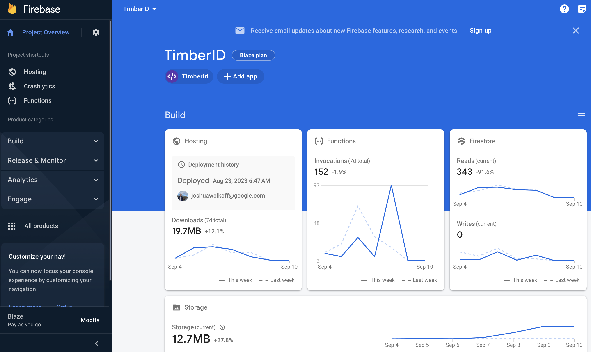

# 🌩 GCP Guide

## Organization Structure

All Google Cloud Assets are stored in a hierarchical structure with the timberid.org organization at its root with two Firebase Projects, river-sky-386919 and timberid-prd serving as the development and production versions respectively.

Below is a diagram of the hierarchy you will also find in the [resource manager in Google Cloud](https://console.cloud.google.com/cloud-resource-manager).

## **Firebase Console**

The Firebase Console is the best tool to view and manage the TimberID components above. This is because it will filter the products to those actually used in TimberID - namely Hosting, Functions and Firestore.

These products are fully managed meaning users do not need to manually scale or manage compute & storage as you would compared to (for example) a postgres server set up in Google Compute.

<figure><figcaption></figcaption></figure>

The [test environment console](https://console.firebase.google.com/project/river-sky-386919/overview) and [production environment console](https://console.firebase.google.com/project/timberid-prd/overview) allow you to:

* Manage your Firebase projects and apps.
* Add and configure Firebase features, such as Authentication, Firestore, Functions and Cloud Storage.
* Monitor your apps' performance and usage.
* Send push notifications to your users.
* Debug and troubleshoot your apps.
* Distribute your apps to the Google Play Store and Apple App Store.

Additional things you can do with the Firebase console:

* Create and manage custom audiences for targeted marketing campaigns.
* Perform A/B testing to optimize your apps.
* Track user behavior and engagement.
* Collect and analyze crash reports.
* Receive alerts when something goes wrong with your apps.

The Firebase console is a powerful tool that can help you manage, develop, and distribute your mobile and web apps.

### Access and Admin Permissions

See the [Admin Accounts Page](../../internal/internal-information.md).

## Firebase Learning Resources

A large amount of firebase resources can be found on the [Firebase Youtube channel](https://www.youtube.com/user/firebase). This includes a few videos in Portuguese.

A full set of documentation for firebase is found on the [main Firebase website](https://firebase.google.com/docs).

