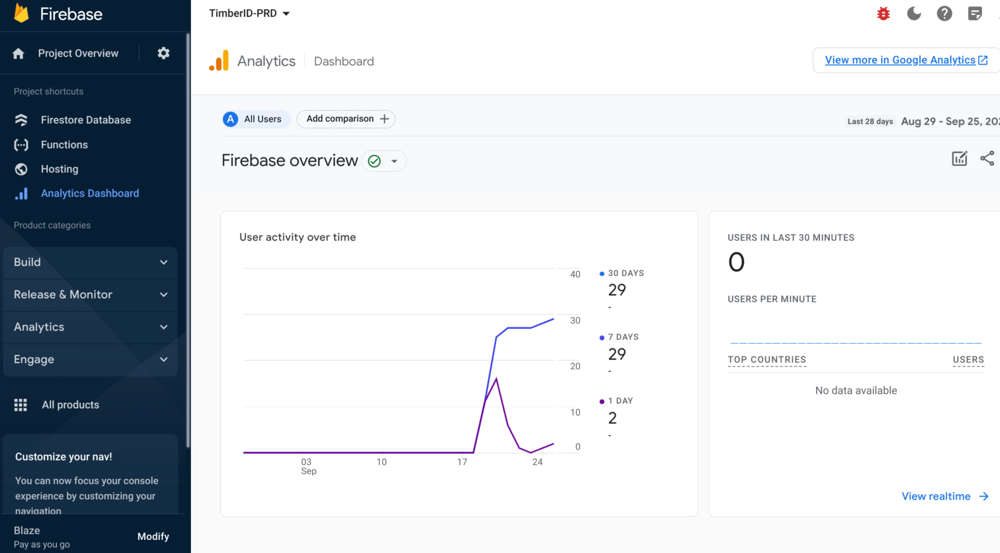

# 📈 Analytics

TimberID uses Firebase Analytics which shows:

* Daily Active Users (30day, 7day, 1day unique visitors over that timeframe)
* Average Engagement Time
* Engaged Sessions per User
* Detailed event counts for page views, first sessions etc.

<figure><figcaption></figcaption></figure>

These are all standard metrics out of the box in Firebase and can further customized.

To view the analytics page for TimberID, navigate to the [Firebase console](https://firebase.corp.google.com/u/0/project/timberid-prd/analytics/app/web:ZjUyYjZlNTMtMmFjNi00MmEzLTk3NGYtODFkMjAwOWI4YjMy/overview/\~2F%3Ft%3D1695735018491\&fpn%3D307233236699\&swu%3D1\&sgu%3D1\&params%3D\_r.5..selmet%3D%5B%22userEngagementDurationPerSession%22%5D\&cs%3Dapp.m.dashboard.overview\&g%3D1).
