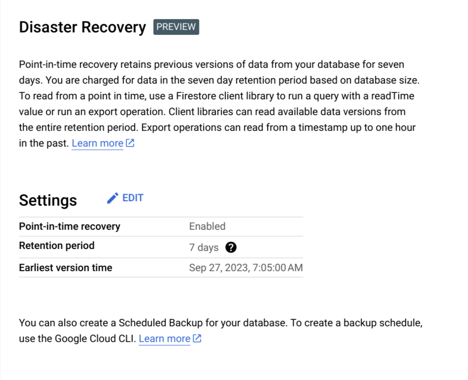

# ⚠ Backups and Disaster Recovery

Disaster recover is enabled for the production firestore database for a 7 day retention period. You may also manually create backups. The storage for these options are billable, so creating more backups or increasing the retention period will increase cost.

<figure><figcaption></figcaption></figure>

You can see more in the [disaster recovery options](https://console.cloud.google.com/firestore/databases/-default-/disaster-recovery?authuser=0\&project=timberid-prd\&hl=en) for the production project.

If you want to access the data to restore into the current database, see [how to use the gcloud command line interface](https://cloud.google.com/firestore/docs/use-pitr?hl=en#export\_and\_import\_from\_a\_consistent\_pitr\_version) to export firestore data from an old timestamp and then reimport.

