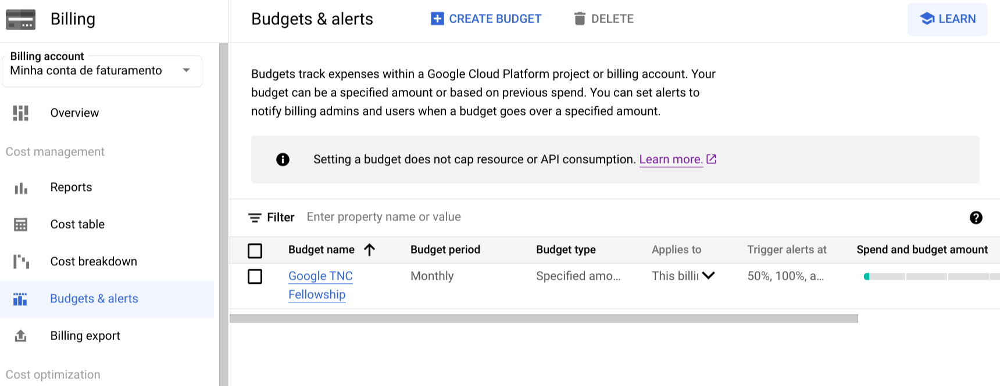

# 💰 Budget Alerts

Budget Alerts in Google Cloud can be associated with a billing account.

The current alerts are set up at 50%, 90%, and 100% of a target budget.

This data can be viewed in the [Google Cloud Console Budget and Alert](https://console.cloud.google.com/billing/01DB0E-F0A969-6BF960/budgets?organizationId=652485703918) page.

<figure><figcaption></figcaption></figure>

The amount and threshold of the alerts may be changed here. You may also alert on the value being forecasted (a forecast projects that you will reach a target) or the target actually being met.

See the [Google Cloud Console](https://cloud.google.com/billing/docs/how-to/budgets) page for more information on creating budgets.

