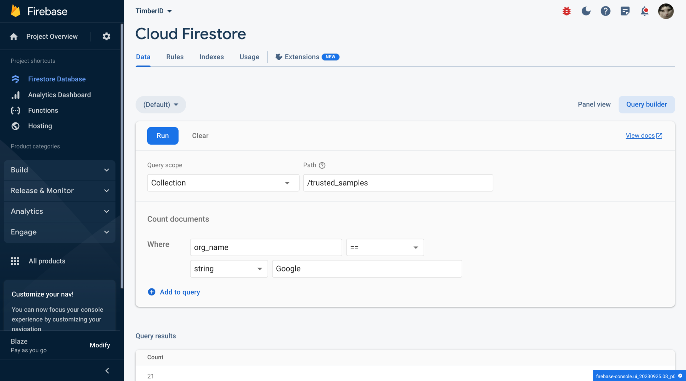

# 💾 Database Query Builder

Firestore allows you to create a rudimentary query. This query, while not SQL (Firestore is a NoSQL document store), allows you to understand the sample counts per organisation.

<figure><figcaption></figcaption></figure>

This query can be found on the [Firebase console](https://firebase.corp.google.com/u/0/project/timberid-prd/firestore/data/\~2Fnew\_users\~2FQDsqoCZ3bFWvwhqxrydFAKkOQkY2?view=query-view\&scopeType=collection\&scopeName=%2Ftrusted\_samples\&query=2%7CCOU%7CWH%7C1%7C8%2Forg\_name%7CEQ%7CSTR%7C6%2FGoogle).
