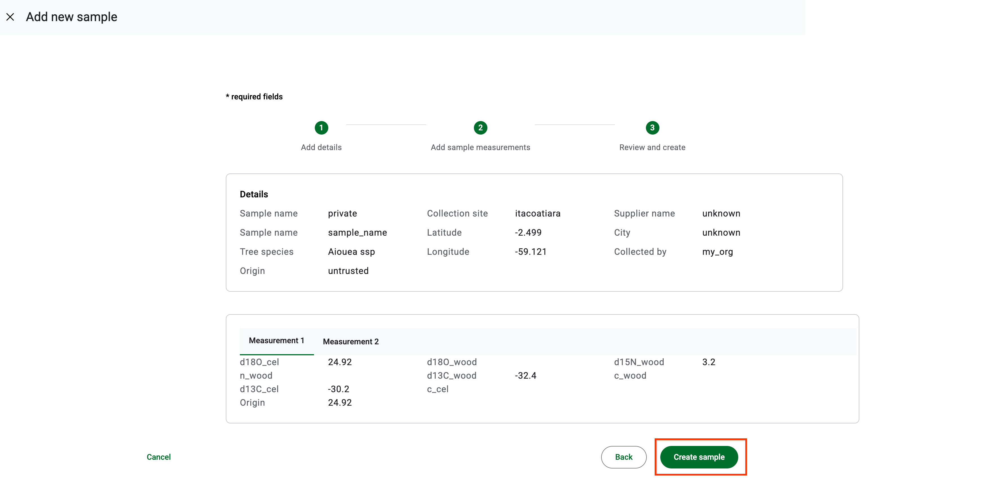

# 🚀 Test Procedure for Production Release

## General Functionality Test Plan

### New User Registration

1. Access TimberID [timberid.org](http://timberid.org)
2. Navigate to the sign-in/sign-up page:

<figure><figcaption></figcaption></figure>

3. Under sign up, enter in a new FirstName 'myfname' and LastName 'mylname' and choose the 'TNC' organization:

<figure><figcaption></figcaption></figure>

4. Click Next
5. Enter the email 'flname2@me.com' and password '123123' with a confirmation password '123123':

<figure><figcaption></figcaption></figure>

6. Click "Signup"
7. Empty sample page is shown. Expecting zero samples to show:

<figure><figcaption></figcaption></figure>

8. Log out

<figure><figcaption></figcaption></figure>

9. Log in using adminuser1@me.com and '123123' as password:

<figure><figcaption></figcaption></figure>

10. Navigate to the Sign up requests screen
11. Approve the user flname into the 'TNC' organization by clicking the 'Approve' button&#x20;

<figure><figcaption></figcaption></figure>

12. Log out and log in again as flname2@me.com with password '123123' Click signIn
13. All Samples page shows all current In progress and Completed samples:&#x20;

<figure><figcaption></figcaption></figure>

14. Log out
15. Log in again as adminuser1 per step 7
16. Navigate to the All users screen and delete flname@me.com by clicking Remove&#x20;

<figure><figcaption></figcaption></figure>

17. Log out. Log in as flname2@me.com with password 123123
18. Verify that no samples are shown.
19. Click on the profile icon and choose Manage profile&#x20;

<figure><figcaption></figcaption></figure>

20. &#x20;Then click on Delete button in order to delete flname2@me.com user

<figure><figcaption></figcaption></figure>

### New Organization Registration

1. Access TimberID [timberid.org](http://timberid.org)
2. Navigate to the sign-in/sign-up page. Under signup input Maria as First Name and Antonieta as Last name. Under Organization, choose Create new organization, then click Next

<figure><figcaption></figcaption></figure>

3. Type Versalhes in New org name field, under e-mail include maria.antonieta@versalhes.com and for Password type 123123 then repeat it in the confirm password field. Click in Sign Up.

<figure><figcaption></figcaption></figure>

4. Empty sample page is shown. Expecting zero samples to show.&#x20;
5. Click in the profile icon and change the language to Portuguese. The text showed in the screen must be changed to Portuguese.

<figure><figcaption></figcaption></figure>

6. Click in the profile icon and click in Log out.\

7. Log in using adminuser1@me.com and '123123' as password (as this user is System Admin, it will be able to approve the new org request)
8. Click in Sign up requests, scroll down the screen and under Organization, approve the request from Maria Antonieta.

<figure><figcaption></figcaption></figure>

9. Click in the profile icon and then in Log out.

## Lab user activities

### Single reference sample

1. Access TimberID [timberid.org](http://timberid.org) and login with maria.antonieta@versalhes.com as user and  123123 for password.
2. Click in Add sample -> Single reference sample

<figure><figcaption></figcaption></figure>

3. Fill the fields as shown in the picture below, and then click Next.

<figure><figcaption></figcaption></figure>

4. Fill the measurements as shown in the picture and then click Next.

<figure><figcaption></figcaption></figure>

5. Then click in Create sample:

<figure><figcaption></figcaption></figure>

### Import samples

1. TimberID has the functionality to import samples in csv format. Please use this file as an example to import.



2. Under "Add Sample", choose "Import Samples"

<figure><figcaption></figcaption></figure>

3. A pop-up screen will appear asking for the csv file. Choose the import file.
4. The message "Successfully imported file" should appear

<figure><figcaption></figcaption></figure>

### Edit Samples

1. Under Completed samples, type the code mad11 in search button in order to find the imported samples

<figure><figcaption></figcaption></figure>

2. Click in Edit button on mad1111 sample to edit some details.

<figure><figcaption></figcaption></figure>

3. Edit "Sample name"changing it to TESTE and then click in "Update sample" button.

<figure><figcaption></figcaption></figure>

4. Sample details must be shown.

### Delete samples

1. Under Completed samples, type the code mad111 in search button in order to find the imported samples

<figure><figcaption></figcaption></figure>

2. Click the delete button in order to delete sample **mad1111.**

<figure><figcaption></figcaption></figure>

### Export sample

1. Under Completed samples, type the code mad1112 in search button&#x20;

<figure><figcaption></figcaption></figure>

2. Select the sample mad1112 and then click the button Export selected

<figure><figcaption></figcaption></figure>

3. Open the downloaded file and check the information exported.
4. Delete the sample mad1112.
