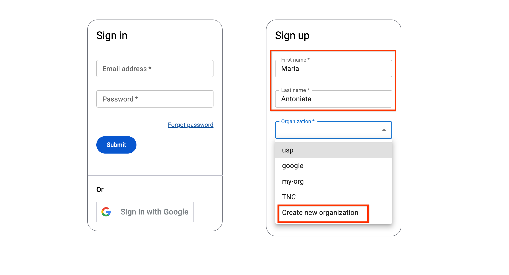
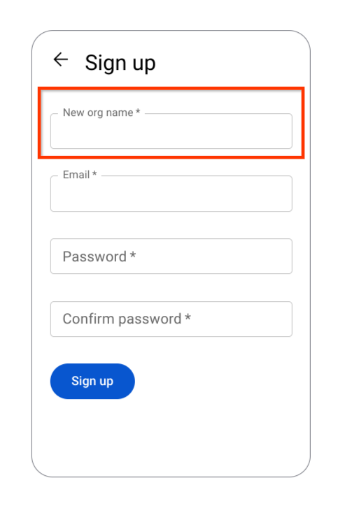
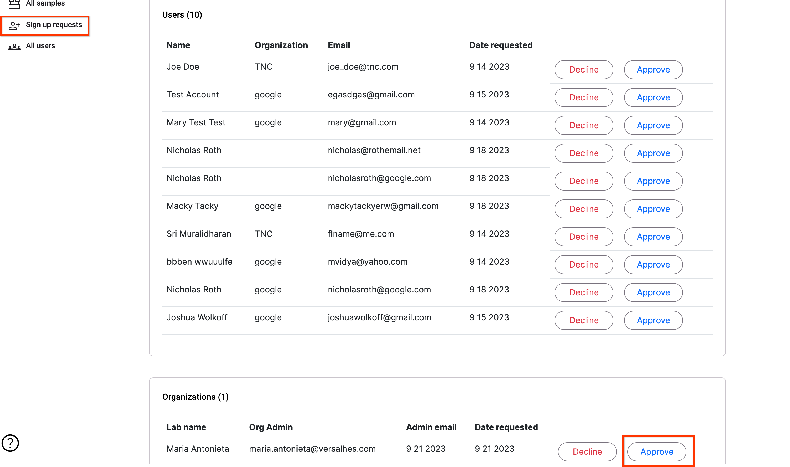

# 🧑🤝🧑 Creating Organizations

TimberID Organizations are boundaries of data visibility. No data between organizations is shared nor is data from an organization shared publicly.

If an organization wishes to share data with another organization, they may export their data and then allow another organization to import it. Note that this creates a duplicate of the data and no changes will be tracked between the organizations after this.

To create an organization, a new user that wishes to be the organization administrator Signs Up to TimberID and instead of choosing an organization, selects the "Create New Organization" option.

<figure><figcaption></figcaption></figure>

Once you click Next you select the Name of your organization and fill out information about the Organization Administor, whose account will also be created.

<figure><figcaption></figcaption></figure>

Once you click Sign Up, your request must be approved by a Site Administrator as below:

<figure><figcaption></figcaption></figure>

See the [Managing Users](managing-users.md) section to understand the different user roles in TimberID and how to assign them
