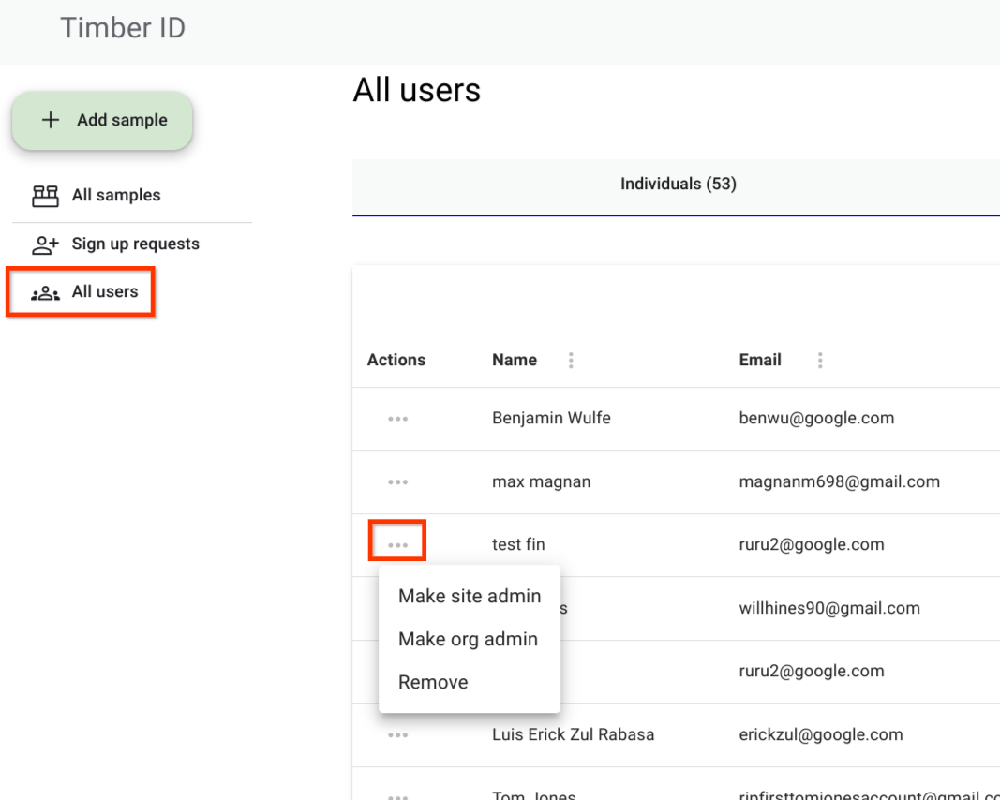

# 🚸 Managing Users

### Roles and Permissions

TimberID has three different roles. Regular users are called Organization Members. All users must belong to an Organization. Beyond regular users, there are two types of Aministrators, Site Administrators and Organization Administrators. These are described below.

<table><thead><tr><th width="191.33333333333331">User Role Type</th><th>Abilities</th><th>How to Create</th></tr></thead><tbody><tr><td>Site Administrator</td><td>Approve New Organizations Approve New Users Remove Users Assign Site Administrator Role Assign Org Administrator Role</td><td>Only existing Site Administrators can assign this role to new users. See a TimberID admin for help</td></tr><tr><td>Organization Administrator</td><td>Approve New Users Remove Users Assign Org Administrator Role</td><td>Org Adminsitrators are created when an Organization is first created and may be assigned by an existing Site or Org administrator. </td></tr><tr><td>Organization Member</td><td>Can see all sample data in TimberID and use the Earth Engine API to load data in Python</td><td>Sign Up with a particular Organization and have an Organization Admin or Site Admin approve you.</td></tr></tbody></table>

### Assigning Roles

To change the role of an existing user, navigate to the All Users screen and select the dropdown to assign a role.

<figure><figcaption></figcaption></figure>

