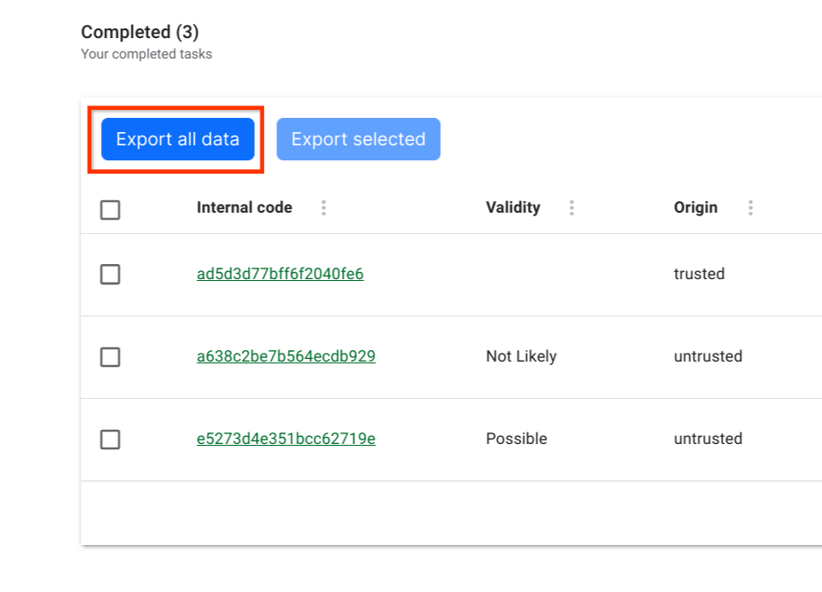

# 📤 Exporting

TimberID allows you to export all sample data to a CSV file for sharing to others. To export, click on  either the Export Selected or Export All Data buttons on the main TimberID screen after you log in as below.

<figure><figcaption></figcaption></figure>

The exported CSV file will have one row per measurement with all necessary fields.

