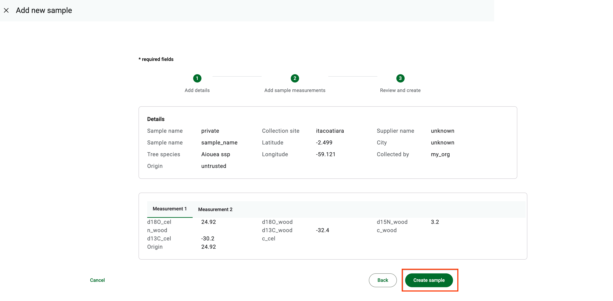
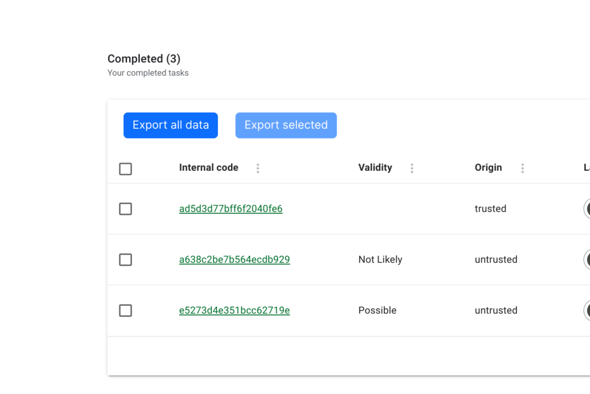
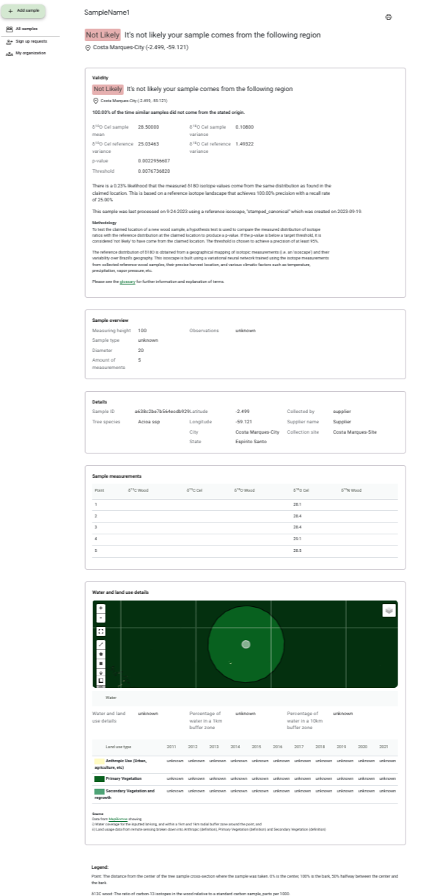

# 🔎 Origin Verification

## What is Origin Verification?

TimberID allows you to enter data analyzed on timber samples that have been harvested by the timber industry or other non-governmental entities. These timber samples often come with paperwork such as a 'Declarations of Forest Origin' (i.e. DOF).&#x20;

Origin Verification is the process of statistically validating the probability that a timber sample was harvested at the location claimed.

The analysis results page will include these statistics as well as other analysis around the claimed location, such as water and vegetation cover and alerts from MapBiomas Alerta.

### Performing Origin Verifcation

1.  Select the 'Origin Verification' option in 'Add Sample'.

    Performing an origin verification requires you to enter data identical to adding reference samples. Follow [those instructions](single-reference-sample-+-import/), but ensure the 'Origin' is set to 'Uncertain'\

2.  Click 'Create Sample' as below.\
    This adds the sample and begins the background task of analysis.\

    <figure><figcaption></figcaption></figure>

3.  After about 5 minutes (our current SLO for performing analysis), you will see a value appear for Validity on the main Samples page as below.\

    <figure><figcaption></figcaption></figure>

    Validity be one of two values:\
    \* Not Likely: The statistical analysis has determined it is very unlikely that the harvest location claimed represents the place where the tree grew.\
    \* Possible: The statistical analysis has not determined that the timber sample has come from the claimed location or not.\

4.  Clicking on details of the sample will bring up the analysis results page with additional analytics.\

    <figure><figcaption></figcaption></figure>

5. Clicking on the print icon in the top right allows you to print or save the analysis to a PDF file.

The following analytics are current calculated in the report:

<table><thead><tr><th width="208">Section</th><th width="170.33333333333331">Source</th><th>Description</th></tr></thead><tbody><tr><td><strong>Validity</strong></td><td>TimberID</td><td>Performs a statistical t test comparing the isotope distribution measured to that expected based on a reference isoscape built from reference samples. For more information on technique, see the  section.</td></tr><tr><td><strong>Sample Information</strong></td><td>TimberID</td><td>Information as entered on the timber sample</td></tr><tr><td>  Overview</td><td></td><td></td></tr><tr><td>  Details</td><td></td><td></td></tr><tr><td>  Measurements</td><td></td><td></td></tr><tr><td><strong>Water and Land Use</strong></td><td>MapBiomas</td><td>Historical and current vegetation and water at the claimed latitude and longitude.</td></tr><tr><td><strong>Deforestation Alerts</strong></td><td>MapBiomas Alerta</td><td>Relevant alerts, if any, at the claimed latitude and longitude.</td></tr></tbody></table>

